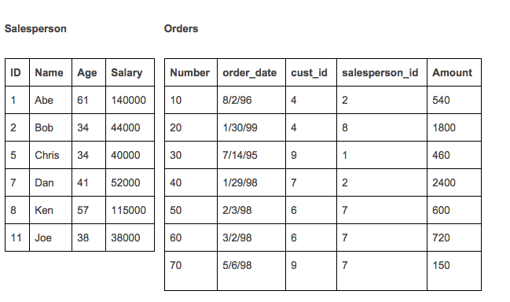

#Galvanize Technical Assessment for Data Science Course

Hello!
Thanks for applying to the Data Science Immersive at Galvanize. Please complete the assessment here to accompany your application. Return your answers within 4 hours in an email with separate attachments (1 file per question) to admissions@galvanize.com with the email subject “Data Science Technical Assessment: YOUR NAME.”        
We’ll reach out soon with next steps.
Thanks!
Galvanize


##Question 1:
###The challenge is to create a text content analyzer. This is a tool used by writers to find statistics such as word and sentence count on essays or articles they are writing.
**Write a Python program that analyzes input from a file and compiles statistics on it.**
The program should output:
1. The total word count
2. The count of unique words
3. The number of sentences
*Example output:*
```
Total word count: 468
Unique words: 223
Sentences: 38
```
**Brownie points will be awarded for the following extras:**
1. The ability to calculate the average sentence length in words
2. The ability to find often used phrases (a phrase of 3 or more words used over 3 times)
3. A list of words used, in order of descending frequency
4. The ability to accept input from STDIN, or from a file specified on the command line.

*This question should be written in Python. Please submit a file (question1.py) with your code.*


##Question 2:
**Suppose we have 2 tables called Orders and Salesperson shown below:**



**Write a SQL query that retrieves the names of all salespeople that have more than 1 order from the tables above. You can assume that each salesperson only has one ID.**

*Please submit a file question2.sql with your query.*


##Question 3 (Split-Test-Analysis):
###Introduction
As context, here's a 10,000-foot view of the Acme Corp product:
A consumer posts a request for a service needed. Every request is in some category (e.g., Catering, Personal Training, Interior Design) and some location (e.g., New York, San Francisco).

We match the request up with appropriate service providers and send each of those providers an invite to quote on the request.
Providers view the invite and some choose to send a quote to the consumer expressing interest.

For the following questions, please be as specific and thorough as possible in your answers, quantify your statements as much as you can, and explain your computations. Include code you used where appropriate. You're free to use any software you like; it's OK if we can't run the analysis ourselves. You're encouraged to be as technical as you like in your answers, they don't need to be accessible to general readers (though that's an important part of the actual job).

###Split Test Analysis
I've just concluded a test of our quote form. After receiving an invite, service providers come to the quote form to view the consumer request and choose whether or not to pay to send a quote. My goal was to determine if certain changes to the design of the form would cause more providers to send a quote after coming to the page.

Over the course of a week, I divided invites from about 3000 requests among four new variations of the quote form as well as the baseline form we've been using for the last year. Here are my results:        
```
Baseline: 32 quotes out of 595 viewers
Variation 1: 30 quotes out of 599 viewers
Variation 2: 18 quotes out of 622 viewers
Variation 3: 51 quotes out of 606 viewers
Variation 4: 38 quotes out of 578 viewers
```

**What's your interpretation of these results? What conclusions would you draw? What questions would you ask me about my goals and methodology? Do you have any thoughts on the experimental design? Please provide statistical justification for your conclusions and explain the choices you made in your analysis.**

For the sake of your analysis, you can make whatever assumptions are necessary to make the experiment valid, so long as you state them. So, for example, your response might follow the form *"I would ask you A, B and C about your goals and methodology. Assuming the answers are X, Y and Z, then here's my analysis of the results... If I were to run it again, I would consider changing...".*

**Here are the data in CSV form, if that's more convenient:**
```
Bucket,Quotes,Views
Baseline,32,595
Variation 1,30,599
Variation 2,18,622
Variation 3,51,606
Variation 4,38,578
```

*Please submit a text, markdown or pdf file with your analysis.*
