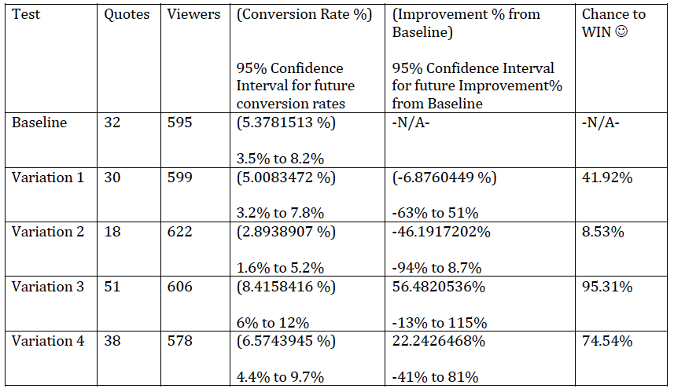

#Split Test Experiment Analysis for Acme Corp product

##What’s your interpretation of these results?

The direct results from the split test invite design show that the invite, Variation 3, provides the largest improvement in converting views to paid quotes. Data shows a significant 56 % improvement from the Baseline design! The second most effective invite design is Variation 4 with the second highest improvement of paid quotes to views. Data shows a 46% improvement from the Baseline design. Variation 2 is the least effective invite design with the lowest conversion rate of views to paid quotes. Data shows a 46% decline in effectiveness from the Baseline design. The invite designs: Variation 1 and Baseline, have slight differences in their effectiveness. The data shows that Variation 1 had a decline in effectiveness of nearly 7 percent from the Baseline. 

Assuming that all variables mentioned below were considered while conducting this experiment it is recommended to replace the Baseline invite design with Variation 3 invite design immediately. I am 95% confident that this is the best choice out of the four Variations in comparison to the Baseline design. I am also 95% confident that the continued use of Variation 3 will have a conversion rate between 6% and 12% from viewers to paid quotes and thus being anywhere in between being a -13% to 115% improvement from the Baseline design. 

> **What questions would you ask me about my goals and methodology?** 
> **Do you have any thoughts on the experimental design?** 
> **What conclusions would you draw?**

###I would ask you if the following variables were considered: 
• **What time of day and or time of the week were the invite designs sent to providers?**
    If certain invite designs were sent during unusual periods (Holidays, stock market crash, etc) or during peak hours and others were sent during nonpeak hours, further research would be recommended to see if these factors impair the experiment. If the invite designs were sent out all relative to each other, this is not a concern.

• **Are the views the same as unique viewers?**
    Meaning, are any of the views repeated from the same provider on the same invite request? If the viewers are unique to each invite request, then this is not of concern. However, if the viewers are not tracked as being unique, then this could skew the experiment’s results and further testing would be recommended with this in mind. 

• **What methods were used to get the invite form to the provider (such as: text, fax, mail, email etc)?**
    Outside of the invite form’s design, were other conditions altered that were not consistent for all invite forms? For example: if the form was sent via email, was it sent with the same Subject Header, or, if it was sent via mail, was it sent in the same color envelope, etc.? This is a concern because if the subject line was different for any of the invite form designs (sent via email), then this variable cannot be ignored and the effectiveness of this experiment is now null, unless this analysis is only studying the invites that were viewed and not necessarily studying the total sent invites. However, if all conditions outside of the form’s design were consistent, this would not alter the analysis for this experiment (if we are considering all sent invites). 

• **If sent electronically, are the algorithms the same in each invite design form?**
    This variable is similar to the previous statement above. For example, does one form allow a customer to mention a direct phone number while another weeds this information out? This is of a concern because the provider could avoid paying for a quote and call the customer directly instead. Another example, does one form have a better algorithm to match service requests with the respectable providers? If the forms have identical algorithms to pull customer requests and send to relative providers, this is not a concern in relation to this experiment. 

• **Did you use a split testing tool that cookies visitors?** 
    This is important so the viewer only sees one variation.

• **Did you compare data from the same data source?**
    This is important because some programs can interpret data differently. For example AdWords and Analytics don’t match. 

• **Did you consider that robots might interrupt and screw the experiment’s data?**
    Google Analytics and Google Website Optimizer are usually safe from robots.

>This last question doesn’t necessarily impact this experiment’s results, but it does bring up important questions about the company’s goals and methodology of gathering data:

• **I would question how the data is being tracked, what is being repeated in the count for requests and views, and also how many unique requests are being answered with at least one quote.**
    The reason for asking this is because it is said that there are 3,000 requests and each request was sent in one of the five-invite forms.  After sending the requests in various invite forms there are exactly 3,000 views. I am curious to understand how that is possible, since majority of mail/ email is discarded without being looked at first (if this was the method used to send the invites). Is this data only considering the views as a 1st condition to this experiment? If so then the exact number of 3,000 views matching with the sent invites would make more sense. For the sake of this assignment I understand it may just be a coincidence that there are exactly 3,000 views on 3,000 requests, (possibly meaning 100% of all invite emails were opened…if that was the only method used to sending requests).
    
    This information would be valuable to determine if each customer request is getting at least one quote and also not too many quotes. This is of a concern, because if a considerable amount of customer requests are left unanswered or customers are bombarded with quotes and or salespeople, this may impact traffic to the site negatively, and thus result in less unique requests, leaving providers possibly fighting harder for each customer’s business (if the providers decide to continue to do business with the site at that point reducing the number of paid quotes). 

